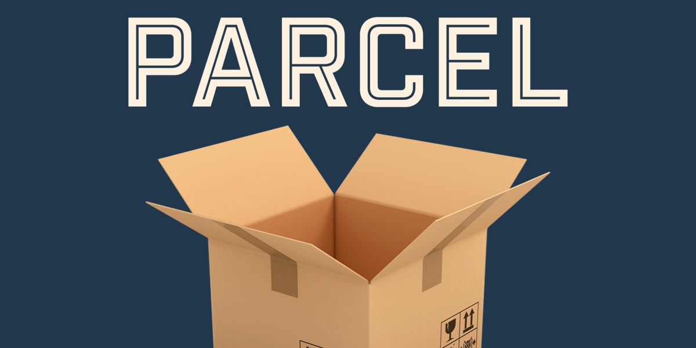

<div align=center>
    
    <h1>Mastering Parcel Bundler</h1>
</div>

---

## Introduction

This repository is a self-journey to master Parcel Bundler. Parcel is a powerful web application bundler that offers zero configuration, blazing fast performance, and a plethora of features that streamline the development workflow. This project documents my learning process, experiments, and projects built using Parcel.

I'm going to walk through setting up Parcel for various different common project setups, all in a single project. A large focus throughout the video will be observing how easy Parcel makes these setups and what it's auto-configuring for you. Throughout the video we'll cover:

- Setting up a minimal Parcel project from scratch
- Hot Module Replacement
- Vue
- React
- Svelte
- Typescript
- Modern JS features like conditional chaining, including fallbacks
- Browserslist to customize those fallbacks for cross-browser support
- Importing images in JavaScript
- Sass
- Stylus
- Styled Components
- Pug
- Multiple entry points

This project isn't intended to be used for a realistic app, since it includes several setups all in one, but I will be showing my commits along the way and pushing up the project to Github for anyone following along who wants to review the code.

## Table of Contents

- [Introduction](#introduction)
- [Table of Contents](#table-of-contents)
- [Installation](#installation)
  - [Global Installation](#global-installation)
  - [Local Installation](#local-installation)
- [Basic Commands](#basic-commands)
  - [Initialize a Project](#initialize-a-project)
  - [Create an Entry Point](#create-an-entry-point)
  - [Development Server](#development-server)
  - [Build for Production](#build-for-production)
- [Features](#features)
- [Advanced Configuration](#advanced-configuration)
- [Projects](#projects)
- [Resources](#resources)
- [Contributing](#contributing)

## Installation

To get started with Parcel, you need to have Node.js installed. Then, you can install Parcel globally or locally within your project.

### Global Installation

```bash
npm install -g parcel
```

### Local Installation

```bash
npm install parcel --save-dev
```

## Basic Commands

### Initialize a Project

Initialize a new Node.js project with default settings:

```bash
npm init -y
```

### Create an Entry Point

Create an index.html or index.js file as the entry point for your application. For example, create an index.html file:

```html
<!DOCTYPE html>
<html>
<head>
  <title>Parcel App</title>
</head>
<body>
  <script src="index.js"></script>
</body>
</html>
```

And a corresponding index.js file:

```javascript
console.log('Hello, Parcel!');
```

### Development Server

Run the development server with hot module replacement:

```bash
parcel index.html
```

### Build for Production

Bundle your project for production:

```bash
parcel build index.html
```

## Features

- **Zero Configuration** - Parcel requires no configuration to get started. It automatically handles many common tasks and optimizations for you.

- **Hot Module Replacement** - Parcel automatically updates modules in the browser as you make changes to your source files, without requiring a full reload.

- **Tree Shaking** - Parcel removes unused code from your final bundle, reducing the size of your JavaScript files.

- **Code Splitting** - Parcel splits your code into smaller chunks that can be loaded on demand, improving the performance of your application.

- **Caching** - Parcel caches files to improve build speed, reusing previously generated outputs when the source files have not changed.

- **TypeScript Support** - Parcel has out-of-the-box support for TypeScript, enabling you to use modern JavaScript features and static type checking.

- **CSS and JS Transforms** - Parcel automatically applies Babel, PostCSS, and other transforms to your JavaScript and CSS files, ensuring compatibility with older browsers and adding modern features.

## Advanced Configuration

While Parcel works great out of the box, it also allows for advanced configuration through custom resolvers, transformers, and packagers.

- **Custom Resolvers** - Custom resolvers allow you to customize how Parcel resolves module imports. For example, you can create a resolver to handle custom file extensions or module paths.

- **Transformers** - Transformers allow you to customize how Parcel processes different types of files. For example, you can create a transformer to handle custom file formats or apply specific processing steps.

- **Packagers** - Packagers allow you to customize how Parcel bundles different types of files. For example, you can create a packager to handle custom output formats or apply specific optimizations.

## Projects

- **Project 1**: Basic HTML/CSS/JS setup with Parcel.

- **Project 2**: Vue app with parcel.

- **Project 3**: React app with parcel.

## Resources

- [Parcel Documentation](https://parceljs.org/docs/)

- [Parcel GitHub Repository](https://github.com/parcel-bundler/parcel.git)

- [Parcel Tutorial on YouTube](https://youtu.be/D3EZ9dvjuHI?si=lip9ydFRYjn9ZO0d)

## Contributing

If you have any suggestions or improvements, feel free to open an issue or submit a pull request.
